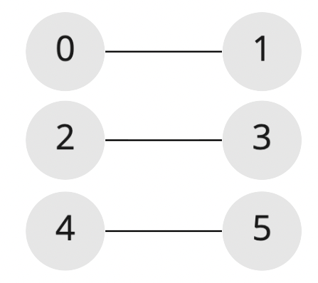

# 연결된 정점들

<br>

## **문제**

방향이 없는 간선들의 목록이 주어질 때, 연결된 정점의 컴포넌트가 몇 개인지 반환하는 함수를 작성하라.

<br>

## **입력**

### **인자 1: edges**

- 2차원 `Array` 타입을 요소로 갖는 시작과 도착 정점이 담겨있는 배열들을 담고 있는 목록 (2차원 배열)
- ex) [[0, 1], [1, 2], [3, 4]]

<br>

## **출력**

- `Number` 타입을 리턴해야 한다.
- 연결된 정점의 컴포넌트의 수를 숫자로 반환한다.

<br>

## **주의사항**

- 주어진 간선은 무향이다.
    - [1, 2] 는 정점 1에서 정점 2로도 갈 수 있으며, 정점 2에서 정점 1로도 갈 수 있다.

<br>

## **입출력 예시**

```jsx
const result = connectedVertices([
	[0, 1],
	[2, 3],
	[4, 5],
]);
console.log(result); // 3
```

해당 정점들은 아래와 같은 모양을 하고 있다.



```jsx
const result = connectedVertices([
	[0, 1],
	[2, 3],
	[3, 4],
	[3, 5],
]);
console.log(result); // 2
```

해당 정점들은 아래와 같은 모양을 하고 있다.

